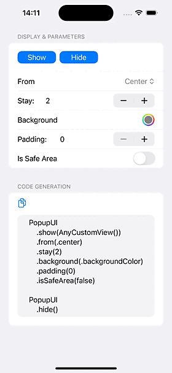
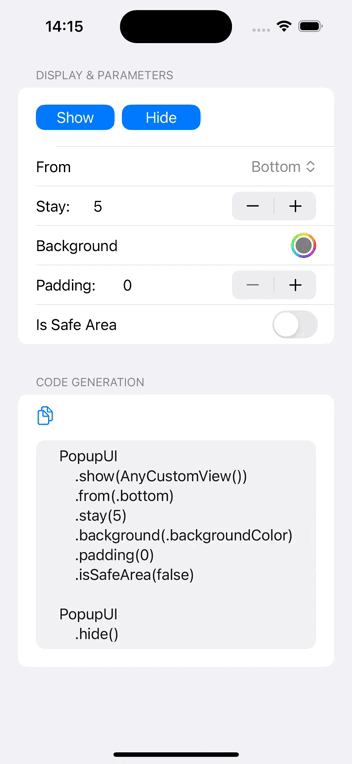
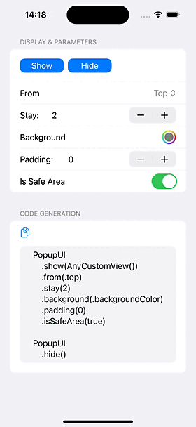
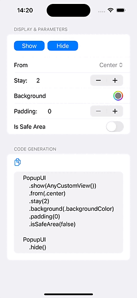

# PopupUI
Easy to Toast & Popup any View by SwiftUI！ [*English README*](README.md)

**SwiftUI 实现的弹窗控件，简单易用！**

SwiftUI で作られた PopupView は、簡単で使いやすいです！[『日本語のドキュメント』](README_JP.md)


## 截图
| 中间提示                   | 中间确认框                   | 底部确认框                |
| -------------------------- | -------------------------- | ----------------------- |
|  |  |  |
| 底部输入框                   | 侧边栏                   | 顶部通知                |
|  |  |  |
| 顶部提示                   | 背景色                   | 生成代码                |
|  |  |  |


## 安装

### Swift Package Manager

```swift
dependencies: [
    .package(url: "https://github.com/pikacode/PopupUI.git")
]
```


### Cocoapods

```ruby
pod 'PopupUI'
```

  

## 使用
```swift
import PopupUI
```

### 基本用法

#### 1.添加
在视图后添加 `.popupUI()` 以在该视图范围内弹窗：
```swift
var body: some View {
    VStack {
        ...
    }
    .popupUI()  // <-- 添加到视图
}
```
**或者**添加到根视图，仅添加一次即可在整个应用程序中弹窗：
```swift
@main
struct PopupUI_demoApp: App {
    var body: some Scene {
        WindowGroup {
            ContentView()
                .popupUI()  // <-- 添加到根视图
        }
    }
}
```

#### 2.展示
```swift
PopupUI
    .show(Text("Hello, PopupUI!"))
```


#### 3.隐藏
```swift
PopupUI
    .hide()     // 隐藏最后一个弹窗
```


​    
### 进阶用法
#### 自定义参数
```swift
PopupUI
    .show(YourCustomView())                 // 自定义视图
    .from(.bottom)                          // 显示的方向
    .stay(2)                                // 显示时间
    .to(.center, .easeOut(duration: 0.3))   // 隐藏的方向并指定动画与时间
    .background(Color.black.opacity(0.3))   // 背景
    .padding(24)                            // 从各方向弹出时增加的偏移量
    .isSafeArea(true)                       // 是否在安全区域内
    .id("Unique Popup ID")                  // 唯一标识，不传时默认使用了同一个 id 所以一次只能弹出一个弹窗，可以通过设置不同的 id 来同时弹出多个弹窗
    .isAvoidKeyboard(true)                  // 是否避开键盘
    .isBackgroundOpaque(true)               // 是否可以透过弹窗的背景点击后面的视图
    .dismissWhenTapBackground(true)         // 点击背景 是否隐藏
    .scaleFrom(0.5)                         // 显示时缩放 value -> 1
    .scaleTo(0.5)                           // 隐藏时缩放 1 -> value
    .opacityFrom(0)                         // 显示时透明度 value -> 1
    .opacityTo(0.5)                         // 隐藏时透明度 1 -> value
		.duplicatedIdBehavior(.ignore)		// id 重复时：.replace 展示最新的 / .ignore 忽略最新的
    .dismissCallback { id in                // 隐藏时的回调
        print("Popup dismissed: \(id)")
    }
```

以回调的方式生成弹出的视图和参数：
```swift
PopupUI
    .show {
        VStack {
            ...
        }
    } config: { config in
        config.from = ...
    }
```

隐藏：
```swift
PopupUI
    .hide("Unique Popup ID")    // 通过 id 隐藏一个指定的弹窗
```

  

#### 全局设置默认参数 
通过设置 `PopupConfiguration.default` 以对自定义参数进行全局统一配置，简化弹出代码：

```swift
let configuration = PopupConfiguration()
configuration.stay = 2
configuration.to = .center
...
PopupConfiguration.default = configuration
```
或者：
```swift
PopupConfiguration
    .default
    .stay(2)
    .to(.center)
    ...
```

   

#### 定义几个样式模板
将 App 中所有样式定义为几个模板，以简化弹出代码：

```swift
extension PopupConfiguration {      //PopupStyle
    static var center: PopupConfiguration {
            PopupConfiguration()
                        .from(.center)
                        .to(.center, .easeOut)
                        ...
    }
    
    static var bottom: PopupConfiguration {
            PopupConfiguration()
                        .from(.bottom)
                        .isOpaque(false)
                        ...                                    
    }
}
                                    
PopupUI
    .show(CenterView())
    .config(.center)        //.style(.center)

PopupUI
    .show(BottomView())
    .config(.bottom)
```
