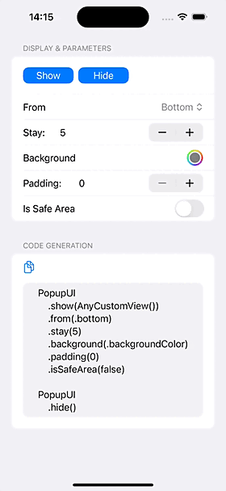
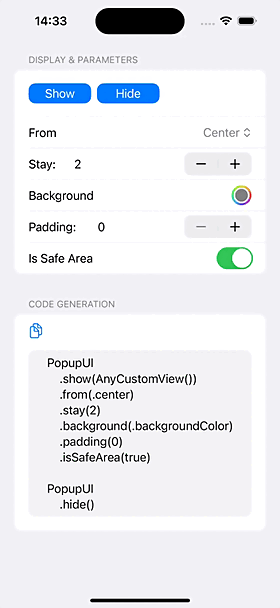

# PopupUI
Easy to Toast & Popup any View by SwiftUI！[*English README*](README.md)

SwiftUI 实现的弹窗控件，简单易用！[《中文文档》](README_CN.md)

SwiftUI で作られた PopupView は、簡単で使いやすいです！


## スクリーンショット
|   中央のヒント                   | 中央の確認           | ボトム確認                |
| -------------------------- | -------------------------- | ----------------------- |
|  |  |  |
| ボトム入力ボックス                   | サイドバー                   | トップ通知                |
|  |  |  |
| トップのヒント                   | 背景色                   | コード生成                |
|  |  |  |
　　
　　
　　
## インストール

### Swift Package Manager

```swift
dependencies: [
    .package(url: "https://github.com/pikacode/PopupUI.git")
]
```


### Cocoapods

```ruby
pod 'PopupUI'
```

  

## 使用方法
```swift
import PopupUI
```

### 基本的な使い方

#### 1.追加
View の後に `.popupUI()` を加えて、そのスコープ内でポップアップします：
```swift
var body: some View {
    VStack {
        ...
    }
    .popupUI()  // <-- 加える
}
```
**または**、ルートビューに加えて、一度だけ追加すると、アプリ全体でポップアップができます：
```swift
@main
struct PopupUI_demoApp: App {
    var body: some Scene {
        WindowGroup {
            ContentView()
                .popupUI()  // <-- ルートビューに加える
        }
    }
}
```

#### 2.表示
```swift
PopupUI
    .show(Text("Hello, PopupUI!"))
```


#### 3.非表示
```swift
PopupUI
    .hide()     // 最後に表示されたポップアップを非表示　 
```


​    
### 高級な使い方
#### カスタムパラメータを設定する
さまざまなパラメータを設定して、表示する：
```swift
PopupUI
    .show(YourCustomView())                 // 表示するビュー
    .from(.bottom)                          // 表示する方向
    .stay(2)                                // 表示する時間
    .to(.center, .easeOut(duration: 0.3))   // 表示する位置、アニメーション
    .background(Color.black.opacity(0.3))   // 背景の色
    .padding(24)                            // ビューの余白
    .isSafeArea(true)                       // セーフエリアを考慮する
    .id("Unique Popup ID")                  // ユニークな識別子、指定しない場合、デフォルトで同じ id が使用されるため、一度に 1 つのポップアップのみが表示され、異なる id を設定すると複数のポップアップを同時に表示できます
    .isAvoidKeyboard(true)                  // キーボードを避ける
    .isBackgroundOpaque(true)               // 背景後のビューとのインタラクションを防ぐ
    .dismissWhenTapBackground(true)         // 背景をタップして非表示
    .scaleFrom(0.5)                         // 表示時 value -> 1
    .scaleTo(0.5)                           // 非表示時 1 -> value
    .opacityFrom(0.5)                       // 表示時 value -> 1
    .opacityTo(0.5)                         // 非表示時 1 -> value
    .duplicatedIdBehavior(.ignore)          // id 重複時：.replace 最新を表示 / .ignore 最新を無視
    .dismissCallback { id in                // 非表示時のコールバック
        print("Popup dismissed: \(id)")
    }
```

#### コールバックでビューとパラメータを表示する：
```swift
PopupUI
    .show {
        VStack {
            ...
        }
    } config: { config in
        config.from = ...
    }
```

#### 指定したポップアップを非表示：
```swift
PopupUI
    .hide("Unique Popup ID")    // ユニークな id を指定して非表示
```

  

#### グローバル設定
`PopupConfiguration.default` を使用してデフォルトのパラメータをカスタマイズして、ポップアップコードを簡素化できます：
```swift
let configuration = PopupConfiguration()
configuration.stay = 2
configuration.to = .center
...
PopupConfiguration.default = configuration
```
または：
```swift
PopupConfiguration
    .default
    .stay(2)
    .to(.center)
    ...
```
  
    
    
#### スタイルテンプレートを定義する
App 中のすべてのスタイルをいくつかのテンプレートとして定義し、ポップアップコードを簡素化します：

```swift
extension PopupConfiguration {      //PopupStyle
    static var center: PopupConfiguration {
            PopupConfiguration()
                        .from(.center)
                        .to(.center, .easeOut)
                        ...
    }
    
    static var bottom: PopupConfiguration {
            PopupConfiguration()
                        .from(.bottom)
                        .isOpaque(false)
                        ...                                    
    }
}
                                    
PopupUI
    .show(CenterView())
    .config(.center)        //.style(.center)

PopupUI
    .show(BottomView())
    .config(.bottom)
```
